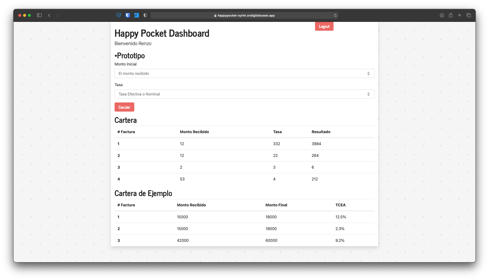
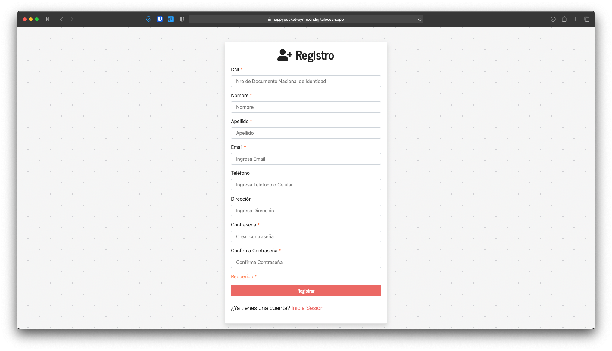
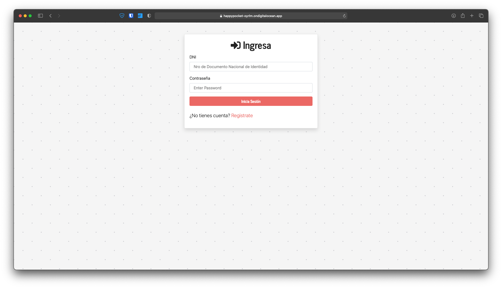

# Happy Pocket Express Api
Para probar el proyecto en la web, haz click [aquí](https://happypocket-oyrlm.ondigitalocean.app).  

Cartera de Facturas para hallar el Tasa de Coste efectivo de distintas Facturas.
## Componentes
### Cartera

### Registro

### Inicio Sesión


## Instalarlo Localmente

  1. Para probarlo localmente installe las dependencias y luego ejecutelo con  `npm run dev`:

```bash
$ npm install
$ npm run dev
```
2. Se ejecutara en el puerto 5000 
3. Lo prueba en el navegador con 
[http://localhost:5000](http://localhost:5000).

